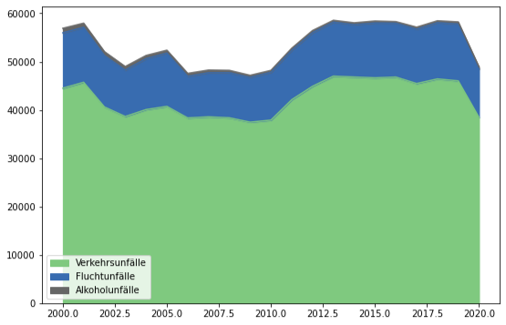
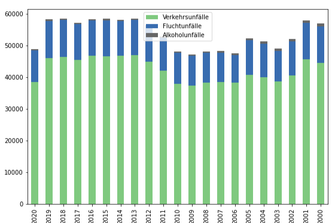
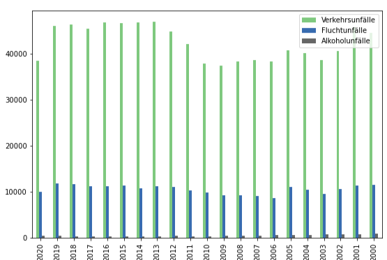
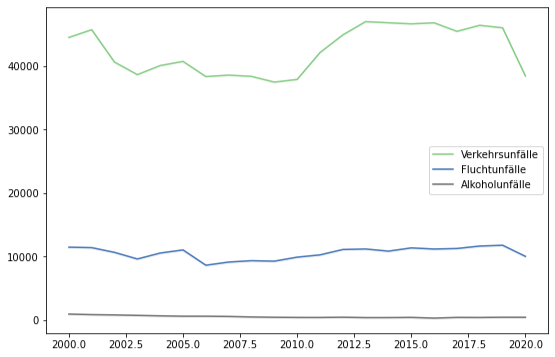

# DPS AI CHALLENGE

## Description

visualization historically the number of accidents per category

## DataFrame

Download the “Monatszahlen Verkehrsunfälle” Dataset from the <a href="https://www.opengov-muenchen.de/dataset/monatszahlen-verkehrsunfaelle/resource/40094bd6-f82d-4979-949b-26c8dc00b9a7"><b>München Open Data Portal</b></a>. Here you see the number of accidents for specific categories per month.

## Packages:

- pandas
- matplotlib
- sklearn

## Visualization:

### Accidents Category Visualization:

### Number of accidents per category

### Number of accidents per Accident Type

