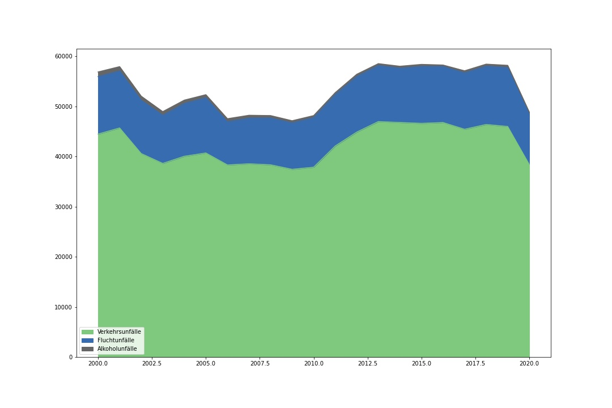

# DPS AI CHALLENGE

## Description
This challenge for Artificial Intelligence Engineer Consists of 3 tasks.
- Mission 1: Create a AI Model
- Mission 2: Publish source code & Deploy
- Mission 3: Sending the URL of the task

## Demo link
View demo <a href="https://dps-ai.herokuapp.com/"><b>Here 💻</b></a>.
Or use this API endpoint  `dps-ai.herokuapp.com/api/predict` to returns your predictions.
#### Note
The endpoint accepts a POST request with a JSON body like this:
```
{
"year" : 2020,
"month" : 10
}
```
It return prediction in the following format:
```
{
"prediction" : value
}
```
## DataFrame

Download the <a href="https://www.opengov-muenchen.de/dataset/monatszahlen-verkehrsunfaelle/resource/40094bd6-f82d-4979-949b-26c8dc00b9a7"><b>Monatszahlen Verkehrsunfälle</b></a> Dataset from the München Open Data Portal. Here you see the number of accidents for specific categories per month.

## Packages:
- pandas
- matplotlib
- sklearn
- pickle

## Visualization:
visualization historically the number of accidents per category
### Accidents Category Visualization:




<br />

### Number of accidents per category


<br />

### Number of accidents per Accident Type

